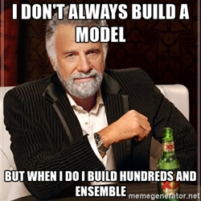
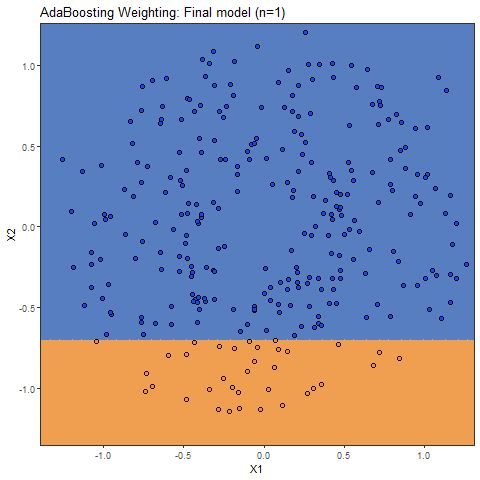

```{r xaringan-themer, include = FALSE}
library(xaringanthemer)
mono_accent(
  base_color = "#006494",
  header_font_google = google_font("Josefin Sans"),
  text_font_google   = google_font("Montserrat", "300", "300i"),
  code_font_google   = google_font("Droid Mono")
)
```
#Aprendizado Estatístico Supervisionado
<br/>
#.large[$$g:\mathcal{X}\rightarrow\mathcal{Y}$$]

<br/>
#.large[$$\hat{g}(\mathbf{X})=\mathbf{Y}$$]
---

# Aprendizado Estatístico Supervisionado
.center[]

---
# Aprendizado Estatístico Supervisionado
.center[]

---
class: inverse, center, middle

# Modelos de Ensemble

---

# Modelos de Ensemble

<br/>
<br/>

.center[]


---
# Modelos de Ensemble

<br/>
<br/>

.center[]

---

# Modelos de Boosting

-**Boosting Adaptativo**
<br/>
<br/>
--
-Boosting Gradiente
<br/>
<br/>
--
-Boosting Gradiente Estocástico
<br/>
<br/>
--
-eXtreme Gradient Boosting
<br/>
<br/>
--
-LightBoosting

---

class: inverse, center, middle

# Boosting Adaptativo
## (AdaBoosting)

---

# AdaBoosting

Dado $$\mathbf{y}\in\{1,1\}$$
<br/>
<br/>

$$G(\mathbf{x})=sign \left(\sum_{m=1}^{M} \alpha_{m}g_{m}(\mathbf{x}) \right)$$

--
<br/>
<br/>
##.center[A sabedoria ponderada das multidões]


---

# AdaBoosting

<br/>
<br/>

.center[]


---
background-image: url(D:/my_computer/Est_ML_2019/presentation_meet_data_bahia/macaco_fazendo_conta.gif)
background-size: cover
class: center, middle, inverse

# Hora das contas...

---

#AdaBoosting

```{r message=FALSE, warning=FALSE, eval=require('tidyverse'), echo=FALSE}
library(magrittr)
library(kableExtra)

medical_care<-data.frame(Chest_Pain=c("Yes","No","Yes","Yes","No","No","Yes","Yes"),
                         Blocked_Arteries=c("Yes","Yes","No","Yes","Yes","Yes","No","Yes"),
                         Patient_Weight=c(205,180,210,167,156,125,168,172),
                         Heart_Disease=c("Yes","Yes","Yes","Yes","No","No","No","No"))

knitr::kable(medical_care,format='html',align = 'c') %>% 
        kable_styling(bootstrap_options = "striped", full_width = F) %>% 
        column_spec(4, bold = T,color='#243B4A')

```


---
#AdaBoosting

```{r message=FALSE, warning=FALSE, eval=require('tidyverse'), echo=FALSE}
library(magrittr)
library(kableExtra)

medical_care<-medical_care %>% 
              mutate(Weights=round(1/nrow(medical_care),3))
               

knitr::kable(medical_care,format='html',align = 'c') %>% 
        kable_styling(bootstrap_options = "striped", full_width = F) %>% 
        column_spec(4, bold = T,color='#243B4A')

```

---

# AdaBoost

```{r message=FALSE,fig.align='center', warning=FALSE, eval=require('tidyverse'),fig.width=4,fig.height=4, echo=TRUE}
library(rpart)
library(rpart.plot)
g1<-rpart(Heart_Disease~Chest_Pain+Blocked_Arteries+Patient_Weight,
             data=medical_care,
             control = rpart.control(maxdepth=1,minsplit = 2))
               
rpart.plot(g1)


```

---

#AdaBoosting
```{r message=FALSE,fig.align='center', warning=FALSE, eval=require('tidyverse'),fig.width=4,fig.height=4, echo=FALSE}
library(rpart)
library(magrittr)
library(kableExtra)
pred<-predict(g1,newdata = medical_care,type='class')

medical_care<-medical_care %>% 
            select(-Weights) %>% 
            mutate(g1=cell_spec(pred,'html',color=ifelse(pred==Heart_Disease,"green","red")))

knitr::kable(medical_care,format='html',align = 'c',escape=F) %>% 
        kable_styling(bootstrap_options = "striped", full_width = F) %>% 
        column_spec(4:5, bold = T,color='#243B4A') 

```
--
$$\alpha_{1}=\frac{1}{2}log\left(\frac{1-\epsilon_{1}}{\epsilon_{1}} \right)$$
--
$$\alpha_{1}=\frac{1}{2}log\left(\frac{1-\epsilon_{1}}{\epsilon_{1}} \right)=\frac{1}{2}log\left(\frac{1-0.125}{0.125} \right)=0.973$$
---
#AdaBoosting
```{r message=FALSE,fig.align='center', warning=FALSE, eval=require('tidyverse'),fig.width=4,fig.height=4, echo=FALSE}
library(rpart)
library(magrittr)
library(kableExtra)
pred<-predict(g1,newdata = medical_care,type='class')

medical_care<-medical_care %>% 
            mutate(New_Weights= " ")

knitr::kable(medical_care,format='html',align = 'c',escape=F) %>% 
        kable_styling(bootstrap_options = "striped", full_width = F) %>% 
        column_spec(4:5, bold = T,color='#243B4A') 

```
--

$$New\;weights_{correct}=weights_{correct}\times e^{-\alpha_{1}}$$
--
$$New\;weights_{correct}=0.125\times e^{-0.973}=0.047$$
---
#AdaBoosting
```{r message=FALSE,fig.align='center', warning=FALSE, eval=require('tidyverse'),fig.width=4,fig.height=4, echo=FALSE}
library(rpart)
library(magrittr)
library(kableExtra)
#pred<-predict(g1,newdata = medical_care,type='class')

medical_care<-medical_care %>% 
            mutate(New_Weights=c(0.047,0.047,0.047," ",0.047,0.047,0.047,0.047))

knitr::kable(medical_care,format='html',align = 'c',escape=F) %>% 
        kable_styling(bootstrap_options = "striped", full_width = F) %>% 
        column_spec(4:5, bold = T,color='#243B4A') 

```
$$New\;weights_{correct}=weights_{correct}\times e^{-\alpha_{1}}$$

$$New\;weights_{correct}=0.125\times e^{-0.973}=0.047$$
---
#AdaBoosting
```{r message=FALSE,fig.align='center', warning=FALSE, eval=require('tidyverse'),fig.width=4,fig.height=4, echo=FALSE}
knitr::kable(medical_care,format='html',align = 'c',escape=F) %>% 
        kable_styling(bootstrap_options = "striped", full_width = F) %>% 
        column_spec(4:5, bold = T,color='#243B4A') 
```
--
$$New\;weights_{wrong}=weights_{wrong}\times e^{\alpha_{1}}$$
--
$$New\;weights_{wrong}=0.125\times e^{0.973}=0.331$$
---
#AdaBoosting
```{r message=FALSE,fig.align='center', warning=FALSE, eval=require('tidyverse'),fig.width=4,fig.height=4, echo=FALSE}
library(rpart)
library(magrittr)
library(kableExtra)
#pred<-predict(g1,newdata = medical_care,type='class')

medical_care<-medical_care %>% 
            mutate(New_Weights=c(0.047,0.047,0.047,0.331,0.047,0.047,0.047,0.047))

knitr::kable(medical_care,format='html',align = 'c',escape=F) %>% 
        kable_styling(bootstrap_options = "striped", full_width = F) %>% 
        column_spec(4:5, bold = T,color='#243B4A') 

```

$$New\;weights_{wrong}=weights_{wrong}\times e^{\alpha_{1}}$$

$$New\;weights_{wrong}=0.125\times e^{0.973}=0.331$$

---
#AdaBoosting

```{r message=FALSE,fig.align='center', warning=FALSE, eval=require('tidyverse'),fig.width=4,fig.height=4, echo=FALSE}
knitr::kable(medical_care,format='html',align = 'c',escape=F) %>% 
        kable_styling(bootstrap_options = "striped", full_width = F) %>% 
        column_spec(4:5, bold = T,color='#243B4A') 

```

---

#AdaBoosting
```{r message=FALSE,fig.align='center', warning=FALSE, eval=require('tidyverse'),fig.width=4,fig.height=4, echo=FALSE}
library(rpart)
library(magrittr)
library(kableExtra)
#pred<-predict(g1,newdata = medical_care,type='class')

medical_care<-medical_care %>% 
            mutate(New_Weights=c(0.071, 0.071, 0.071, 0.502, 0.071, 0.071, 0.071, 0.071)) %>% 
            rename(Norm_Weights=New_Weights)

knitr::kable(medical_care,format='html',align = 'c',escape=F) %>% 
        kable_styling(bootstrap_options = "striped", full_width = F) %>% 
        column_spec(4:5, bold = T,color='#243B4A') 

```


---

#AdaBoosting


```{r,echo=FALSE}
set.seed(4)
reweighted_data<-medical_care[sample(1:nrow(medical_care),nrow(medical_care),
                                     replace = TRUE,
                                     prob = medical_care$Norm_Weights),]

reweighted_data %>% select(Chest_Pain,Blocked_Arteries,Patient_Weight,Heart_Disease) %>% 
knitr::kable(format='html',align = 'c',escape=F,row.names = FALSE) %>% 
        kable_styling(bootstrap_options = "striped", full_width = F) %>% 
        column_spec(4, bold = T,color='#243B4A') 


```

---
#AdaBoosting
```{r,echo=FALSE}

reweighted_data %>% select(Chest_Pain,Blocked_Arteries,Patient_Weight,Heart_Disease) %>% 
knitr::kable(format='html',align = 'c',escape=F,row.names = FALSE) %>% 
        kable_styling(bootstrap_options = "striped", full_width = F) %>% 
        column_spec(4, bold = T,color='#243B4A') %>% 
        row_spec(c(2:4,6), bold = T, color = "white", background = "#3454D1")


```
---


# AdaBoosting

```{r message=FALSE,fig.align='center', warning=FALSE, eval=require('tidyverse'),fig.width=4,fig.height=4, echo=TRUE}
g2<-rpart(Heart_Disease~Chest_Pain+Blocked_Arteries+Patient_Weight,
             data=reweighted_data,
             control = rpart.control(maxdepth=1,minsplit = 2))
               
rpart.plot(g2)
```
---

#AdaBoosting
```{r message=FALSE,fig.align='center', warning=FALSE, eval=require('tidyverse'),fig.width=4,fig.height=4, echo=FALSE}
library(rpart)
library(magrittr)
library(kableExtra)
pred<-predict(g2,newdata = reweighted_data,type='class')

reweighted_data<-reweighted_data %>% 
            select(-c(g1,Norm_Weights)) %>% 
            mutate(g2=cell_spec(pred,'html',color=ifelse(pred==Heart_Disease,"green","red")))

knitr::kable(reweighted_data,format='html',align = 'c',escape=F) %>% 
        kable_styling(bootstrap_options = "striped", full_width = F) %>% 
        column_spec(4:5, bold = T,color='#243B4A') 

```
--
$$\alpha_{2}=\frac{1}{2}log\left(\frac{1-\epsilon_{2}}{\epsilon_{2}} \right)$$
--
$$\alpha_{2}=\frac{1}{2}log\left(\frac{1-\epsilon_{1}}{\epsilon_{1}} \right)=\frac{1}{2}log\left(\frac{1-0.25}{0.25} \right)=0.549$$

---

#AdaBoosting

<br/>
<br/>
$$G(\mathbf{x})=sign \left(\sum_{m=1}^{M} \alpha_{m}g_{m}(\mathbf{x}) \right)$$
--
<br/>
<br/>
$$G(\mathbf{x_{i}})=sign \left(\alpha_{1}g_{1}(\mathbf{x}_{i})+\alpha_{2}g_{2}(\mathbf{x}_{i})+\dots+ \alpha_{M}g_{M}(\mathbf{x_{i}}) \right)$$
--
<br/>
<br/>
$$G(\mathbf{x_{i}})=sign \left(1\times(\alpha_{1,Sim}+\dots+\alpha_{k,Sim})+(-1)\times \right(\alpha_{2,Não}+\dots+\alpha_{p,Não}))$$

---

class: inverse, center, middle

# Dados Simulados


---
# Dados Simulados
.center[]

---
# Dados Simulados
.center[]

---
# Dados Simulados
.center[]

---
background-image: url(D:/my_computer/Est_ML_2019/presentation_meet_data_bahia/frog_write.gif)
background-size: cover
class: center, bottom, inverse

# Mineração de Texto
## (e AdaBoosting)


---

# Text Mining e algumas aplicações

- __Classificação de Textos__

--

- Clusterização de Textos

--

- Análise de Sentimentos

--

- *Concept Extraction*
--

- Summarização de Documentos

---
##Classificação de Textos

.pull.left[]
.pull.right[]
---

# Bag of Words

```{r eval=require('DT'), tidy=FALSE, echo=FALSE,message=FALSE,warning=FALSE}

bag_words_bbc_bs_new <- read_csv("D:/my_computer/Est ML 2018_complete/CSDS/bag_words_bbc_bs_new.csv")
bag_words_bbc_bs_new<-bag_words_bbc_bs_new%>%
      mutate(news_class=news_class%>%as.factor)

kable(bag_words_bbc_bs_new[1:10,1:6],format='html',align = 'c') %>% 
        kable_styling(bootstrap_options = "striped", full_width = F)
```

---

class: center, middle, inverse

# Pré-processamento de texto

---

# Stemming
<br/>
<br/>
.center[]

---

# Stop Words
.center[]

---

# Ponderação dos Termos

Para um __termo i__ no __documento j__

.center[]

---

class: inverse, center, middle

# Modelagem
## AdaBoosting

---
# Base de dados e parâmetros do modelo

-400 observações com 5231 covariáveis

--

-200 notícias de __Esportes__ e 200 notícias de __Negócios__


--

-10-Folds com 10 repetições


--

---

class: center, middle, inverse

# Quantos Stumps (tocos) utilizar?

---

#Tuning
<br/>
<br/>
.center[]
---


---

class: center, middle,inverse

# Obrigado!

mateusmaia11@gmail.com

<br/>
<br/>
Quem quiser explorar um pouco mais o AdaBoosting

mateusmaia.shinyapps.io/adaboosting/
